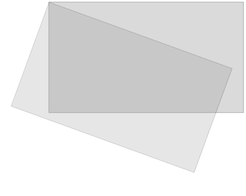
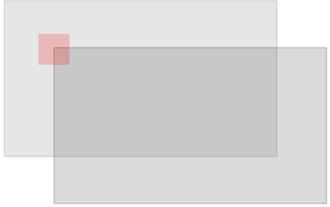
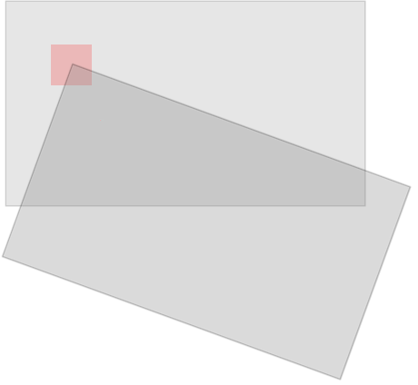
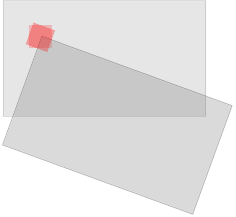
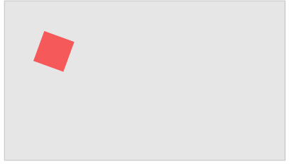

# HTML Game

[Xiao Shang](http://ishx.io)

Learn how to make games, using nothing but HTML and JavaScript.

Table of contents

<!-- MarkdownTOC -->

- [1 Game Intro](#1-game-intro)
    - [1.1 Try it Yourself Examples](#11-try-it-yourself-examples)
- [2 Game Canvas](#2-game-canvas)
    - [2.1 HTML Canvas](#21-html-canvas)
    - [2.2 `.getContext("2d")`](#22-getcontext2d)
    - [2.3 Get Started](#23-get-started)
- [3 Game Components](#3-game-components)
    - [3.1 Add a Component](#31-add-a-component)
    - [3.2 Frames](#32-frames)
    - [3.3 Make it Move](#33-make-it-move)
    - [3.4 Why Clear The Game Area?](#34-why-clear-the-game-area)
    - [3.5 Change the Size](#35-change-the-size)
    - [3.6 Change the Color](#36-change-the-color)
    - [3.7 Change the Position](#37-change-the-position)
    - [3.8 Many Components](#38-many-components)
    - [3.9 Moving Components](#39-moving-components)
- [4 Game Controllers](#4-game-controllers)
    - [4.1 Get in Control](#41-get-in-control)
    - [4.2 Stop Moving](#42-stop-moving)
    - [4.3 Keyboard as Controller](#43-keyboard-as-controller)
    - [4.4 Multiple Keys Pressed](#44-multiple-keys-pressed)
    - [4.5 Using The Mouse Cursor as a Controller](#45-using-the-mouse-cursor-as-a-controller)
    - [4.6 Touch The Screen to Control The Game](#46-touch-the-screen-to-control-the-game)
    - [4.7 Controllers on The Canvas](#47-controllers-on-the-canvas)
- [5 Game Obstacles](#5-game-obstacles)
    - [5.1 Add Some Obstacles](#51-add-some-obstacles)
    - [5.2 Hit The Obstacle = Game Over](#52-hit-the-obstacle--game-over)
    - [5.3 Moving Obstacle](#53-moving-obstacle)
    - [5.4 Multiple Obstacles](#54-multiple-obstacles)
    - [5.5 Obstacles of Random Size](#55-obstacles-of-random-size)
- [6 Game Score](#6-game-score)
    - [6.1 Count The Score](#61-count-the-score)
- [7 Game Images](#7-game-images)
    - [7.1 How to Use Images?](#71-how-to-use-images)
    - [7.2 Change Images](#72-change-images)
    - [7.3 Background Images](#73-background-images)
    - [7.4 Moving Background](#74-moving-background)
        - [7.5 Background Loop](#75-background-loop)
- [8 Game Sound](#8-game-sound)
    - [8.1 How to Add Sounds?](#81-how-to-add-sounds)
    - [8.2 Background Music](#82-background-music)
- [9 Game Gravity](#9-game-gravity)
    - [9.1 Gravity](#91-gravity)
    - [9.2 Hit the Bottom](#92-hit-the-bottom)
    - [9.3 Accelerate Up](#93-accelerate-up)
    - [9.4 A Game](#94-a-game)
- [10 Game Bouncing](#10-game-bouncing)
    - [10.1 Bouncing](#101-bouncing)
- [11 Game Rotation](#11-game-rotation)
    - [11.1 Rotating Components](#111-rotating-components)
    - [11.2 The Component Constructor](#112-the-component-constructor)
- [12 Game Movement](#12-game-movement)
    - [12.1 How to Move Objects?](#121-how-to-move-objects)
    - [12.2 Making Turns](#122-making-turns)
    - [12.3 Use the Keyboard](#123-use-the-keyboard)

<!-- /MarkdownTOC -->


## 1 Game Intro

Learn how to make games, using nothing but HTML and JavaScript.

Push the buttons to move the red square:

### 1.1 Try it Yourself Examples

With our online editor, you can edit the code, and click on a button to view the result.

JavaScript:

```
function startGame() {
    myGamePiece = new component(30, 30, "red", 10, 120);
    myGamePiece.gravity = 0.05;
    myScore = new component("30px", "Consolas", "black", 280, 40, "text");
    myGameArea.start();
}

var myGameArea = {
    canvas : document.createElement("canvas"),
    start : function() {
        this.canvas.width = 480;
        this.canvas.height = 270;
        this.context = this.canvas.getContext("2d");
        document.body.insertBefore(this.canvas, document.body.childNodes[0]);
        this.frameNo = 0;
    },
    clear : function() {
        this.context.clearRect(0, 0, this.canvas.width, this.canvas.height);
    }
}
```

## 2 Game Canvas

The HTML `<canvas>` element is displayed as a rectangular object on a web page:

### 2.1 HTML Canvas

The `<canvas>` element is perfect for making games in HTML.

The `<canvas>` element offers all the functionality you need for making games.

Use JavaScript to draw, write, insert images, and more, onto the `<canvas>`.

### 2.2 `.getContext("2d")`
The `<canvas>` element has a built-in object, called the `getContext("2d")` object, with methods and properties for drawing.

You can learn more about the `<canvas>` element, and the `getContext("2d")` object, in our [Canvas Tutorial](http://ishx.io/canvastutorial/).

### 2.3 Get Started

To make a game, start by creating a gaming area, and make it ready for drawing:

JavaScript:

```
function startGame() {
    myGameArea.start();
}

var myGameArea = {
    canvas : document.createElement("canvas"),
    start : function() {
        this.canvas.width = 480;
        this.canvas.height = 270;
        this.context = this.canvas.getContext("2d");
        document.body.insertBefore(this.canvas, document.body.childNodes[0]);
    }
}
```

The object `myGameArea` will have more properties and methods later in this tutorial.

The function `startGame()` invokes the method `start()` of the `myGameArea` object.

The `start()` method creates a `<canvas>` element and inserts it as the first childnode of the `<body>` element.

## 3 Game Components

Add a red square onto the game area:

### 3.1 Add a Component

Make a component constructor, which lets you add components onto the gamearea.

The object constructor is called `component`, and we make our first component, called `myGamePiece`:

JavaScript:

```
var myGamePiece;

function startGame() {
    myGameArea.start();
    myGamePiece = new component(30, 30, "red", 10, 120);
}

function component(width, height, color, x, y) {
    this.width = width;
    this.height = height;
    this.x = x;
    this.y = y; 
    ctx = myGameArea.context;
    ctx.fillStyle = color;
    ctx.fillRect(this.x, this.y, this.width, this.height);
}
```

The components have properties and methods to control their appearances and movements.

### 3.2 Frames

To make the game ready for action, we will update the display 50 times per second, which is much like frames in a movie.

First, create a new function called `updateGameArea()`.

In the `myGameArea` object, add an interval which will run the `updateGameArea()` function every 20th millisecond (50 times per second). Also add a function called `clear()`, that clears the entire canvas.

In the `component` constructor, add a function called `update()`, to handle the drawing of the component.

The `updateGameArea()` function calls the `clear()` and the `update()` method.

The result is that the component is drawn and cleared 50 times per second:

JavaScript:

```
var myGameArea = {
    canvas : document.createElement("canvas"),
    start : function() {
        this.canvas.width = 480;
        this.canvas.height = 270;
        this.context = this.canvas.getContext("2d");
        document.body.insertBefore(this.canvas, document.body.childNodes[0]);
        this.interval = setInterval(updateGameArea, 20);
    },
    clear : function() {
        this.context.clearRect(0, 0, this.canvas.width, this.canvas.height);
    }
}

function component(width, height, color, x, y) {
    this.width = width;
    this.height = height;
    this.x = x;
    this.y = y; 
    this.update = function(){
        ctx = myGameArea.context;
        ctx.fillStyle = color;
        ctx.fillRect(this.x, this.y, this.width, this.height);
    }
}

function updateGameArea() {
    myGameArea.clear();
    myGamePiece.update();
}
```

### 3.3 Make it Move

To prove that the red square is being drawn 50 times per second, we will change the x position (horizontal) by one pixel every time we update the game area:

```
function updateGameArea() {
    myGameArea.clear();
    myGamePiece.x += 1;
    myGamePiece.update();
}
```
### 3.4 Why Clear The Game Area?

It might seem unnecessary to clear the game area at every update. However, if we leave out the clear() method, all movements of the component will leave a trail of where it was positioned in the last frame:

JavaScript:

```
function updateGameArea() {
    //myGameArea.clear();
    myGamePiece.x += 1;
    myGamePiece.update();
}
```

### 3.5 Change the Size

You can control the width and height of the component:

Create a 10x140 pixels rectangle:

JavaScript:

```
function startGame() {
    myGameArea.start();
    myGamePiece = new component(10, 140, "red", 10, 120);
}
```

### 3.6 Change the Color

You can control the color of the component:

JavaScript:

```
function startGame() {
    myGameArea.start();
    myGamePiece = new component(30, 30, "blue", 10, 120);
}
```

You can also use other colorvalues like hex, rgb, or rgba:

JavaScript:

```
function startGame() {
    myGameArea.start();
    myGamePiece = new component(30, 30, "rgba(0, 0, 255, 0.5)", 10, 120);
}
```

### 3.7 Change the Position

We use x- and y-coordinates to position components onto the game area.

The upper-left corner of the canvas has the coordinates (0,0)

Mouse over the game area below to see its x and y coordinates:


You can position the components wherever you like on the game area:

JavaScript:

```
function startGame() {
    myGameArea.start();
    myGamePiece = new component(30, 30, "red", 2, 2);
}
```

### 3.8 Many Components

You can put as many components as you like on the game area:

JavaScript:

```
var redGamePiece, blueGamePiece, yellowGamePiece;

function startGame() {
    redGamePiece = new component(75, 75, "red", 10, 10);
    yellowGamePiece = new component(75, 75, "yellow", 50, 60); 
    blueGamePiece = new component(75, 75, "blue", 10, 110);
    myGameArea.start();
}

function updateGameArea() {
    myGameArea.clear();
    redGamePiece.update();
    yellowGamePiece.update(); 
    blueGamePiece.update();
}
```

### 3.9 Moving Components

Make all three components move in different directions:

JavaScript:

```
function updateGameArea() {
    myGameArea.clear();
    redGamePiece.x += 1;
    yellowGamePiece.x += 1; 
    yellowGamePiece.y += 1; 
    blueGamePiece.x += 1; 
    blueGamePiece.y -= 1; 
    redGamePiece.update();
    yellowGamePiece.update(); 
    blueGamePiece.update();
}
```

## 4 Game Controllers

Push the buttons to move the red square:


### 4.1 Get in Control
Now we want to control the red square.

Add four buttons, up, down, left, and right.

Write a function for each button to move the `component` in the selected direction.

Make two new properties in the `component` constructor, and call them `speedX` and `speedY`. These properties are being used as speed indicators.

Add a function in the `component` constructor, called `newPos()`, which uses the `speedX` and `speedY` properties to change the component's position.

The newpos function is called from the updateGameArea function before drawing the component:

JavaScript:

```
<script>
function component(width, height, color, x, y) {
    this.width = width;
    this.height = height;
    this.speedX = 0;
    this.speedY = 0;
    this.x = x;
    this.y = y; 
    this.update = function() {
        ctx = myGameArea.context;
        ctx.fillStyle = color;
        ctx.fillRect(this.x, this.y, this.width, this.height);
    }
    this.newPos = function() {
        this.x += this.speedX;
        this.y += this.speedY; 
    } 
}

function updateGameArea() {
    myGameArea.clear();
    myGamePiece.newPos();
    myGamePiece.update();
}

function moveup() {
    myGamePiece.speedY -= 1; 
}

function movedown() {
    myGamePiece.speedY += 1; 
}

function moveleft() {
    myGamePiece.speedX -= 1;
}

function moveright() {
    myGamePiece.speedX += 1;
}
</script>

<button onclick="moveup()">UP</button>
<button onclick="movedown()">DOWN</button>
<button onclick="moveleft()">LEFT</button>
<button onclick="moveright()">RIGHT</button>
```

### 4.2 Stop Moving

If you want, you can make the red square stop when you release a button.

Add a function that will set the speed indicators to 0.

To deal with both normal screens and touch screens, we will add code for both devices:

JavaScript:

```
function stopMove() {
    myGamePiece.speedX = 0;
    myGamePiece.speedY = 0; 
}
</script>

<button onmousedown="moveup()" onmouseup="stopMove()" ontouchstart="moveup()">UP</button>
<button onmousedown="movedown()" onmouseup="stopMove()" ontouchstart="movedown()">DOWN</button>
<button onmousedown="moveleft()" onmouseup="stopMove()" ontouchstart="moveleft()">LEFT</button>
<button onmousedown="moveright()" onmouseup="stopMove()" ontouchstart="moveright()">RIGHT</button>
```

### 4.3 Keyboard as Controller

We can also control the red square by using the arrow keys on the keyboard.

Create a method that checks if a `key` is pressed, and set the key property of the `myGameArea` object to the key code. When the key is released, set the `key` property to `false`:

JavaScript:

```
var myGameArea = {
    canvas : document.createElement("canvas"),
    start : function() {
        this.canvas.width = 480;
        this.canvas.height = 270;
        this.context = this.canvas.getContext("2d");
        document.body.insertBefore(this.canvas, document.body.childNodes[0]);
        this.interval = setInterval(updateGameArea, 20);
        window.addEventListener('keydown', function (e) {
            myGameArea.key = e.keyCode;
        })
        window.addEventListener('keyup', function (e) {
            myGameArea.key = false;
        })
    }, 
    clear : function(){
        this.context.clearRect(0, 0, this.canvas.width, this.canvas.height);
    }
}
```

Then we can move the red square if one of the arrow keys are pressed:

JavaScript:

```
function updateGameArea() {
    myGameArea.clear();
    myGamePiece.speedX = 0;
    myGamePiece.speedY = 0; 
    if (myGameArea.key && myGameArea.key == 37) {myGamePiece.speedX = -1; }
    if (myGameArea.key && myGameArea.key == 39) {myGamePiece.speedX = 1; }
    if (myGameArea.key && myGameArea.key == 38) {myGamePiece.speedY = -1; }
    if (myGameArea.key && myGameArea.key == 40) {myGamePiece.speedY = 1; }
    myGamePiece.newPos(); 
    myGamePiece.update();
}
```

### 4.4 Multiple Keys Pressed

What if more than one key is pressed at the same time?

In the example above, the component can only move horizontally or vertically. Now we want the component to also move diagonally.

Create a `keys` array for the `myGameArea` object, and insert one element for each key that is pressed, and give it the value `true`, the value remains true untill the key is no longer pressed, the value becomes `false` in the keyup event listener function:

JavaScript:

```
var myGameArea = {
    canvas : document.createElement("canvas"),
    start : function() {
        this.canvas.width = 480;
        this.canvas.height = 270;
        this.context = this.canvas.getContext("2d");
        document.body.insertBefore(this.canvas, document.body.childNodes[0]);
        this.interval = setInterval(updateGameArea, 20);
        window.addEventListener('keydown', function (e) {
            myGameArea.keys = (myGameArea.keys || []);
            myGameArea.keys[e.keyCode] = true;
        })
        window.addEventListener('keyup', function (e) {
            myGameArea.keys[e.keyCode] = false; 
        })
    }, 
    clear : function(){
        this.context.clearRect(0, 0, this.canvas.width, this.canvas.height);
    }
}

 function updateGameArea() {
    myGameArea.clear();
    myGamePiece.speedX = 0;
    myGamePiece.speedY = 0; 
    if (myGameArea.keys && myGameArea.keys[37]) {myGamePiece.speedX = -1; }
    if (myGameArea.keys && myGameArea.keys[39]) {myGamePiece.speedX = 1; }
    if (myGameArea.keys && myGameArea.keys[38]) {myGamePiece.speedY = -1; }
    if (myGameArea.keys && myGameArea.keys[40]) {myGamePiece.speedY = 1; }
    myGamePiece.newPos(); 
    myGamePiece.update();
}
```

### 4.5 Using The Mouse Cursor as a Controller

If you want to control the red square by using the mouse cursor, add a method in `myGameArea` object that updates the x and y coordinates of the mouse cursor.

JavaScript:

```
var myGameArea = {
    canvas : document.createElement("canvas"),
    start : function() {
        this.canvas.width = 480;
        this.canvas.height = 270;
        this.canvas.style.cursor = "none"; //hide the original cursor
        this.context = this.canvas.getContext("2d");
        document.body.insertBefore(this.canvas, document.body.childNodes[0]);
        this.interval = setInterval(updateGameArea, 20);
        window.addEventListener('mousemove', function (e) {
            myGameArea.x = e.pageX;
            myGameArea.y = e.pageY;
        })
    }, 
    clear : function(){
        this.context.clearRect(0, 0, this.canvas.width, this.canvas.height);
    }
}
```

Then we can move the red square using the mouse cursor:

JavaScript:

```
function updateGameArea() {
    myGameArea.clear();
    if (myGameArea.x && myGameArea.y) {
        myGamePiece.x = myGameArea.x;
        myGamePiece.y = myGameArea.y; 
    }
    myGamePiece.update();
}
```

### 4.6 Touch The Screen to Control The Game

We can also control the red square on a touch screen.

Add a method in the myGameArea object that uses the x and y coordinates of where the screen is touched:

JavaScript:

```
var myGameArea = {
    canvas : document.createElement("canvas"),
    start : function() {
        this.canvas.width = 480;
        this.canvas.height = 270;
        this.context = this.canvas.getContext("2d");
        document.body.insertBefore(this.canvas, document.body.childNodes[0]);
        this.interval = setInterval(updateGameArea, 20);
        window.addEventListener('touchmove', function (e) {
            myGameArea.x = e.touches[0].screenX;
            myGameArea.y = e.touches[0].screenY;
        })
    }, 
    clear : function(){
        this.context.clearRect(0, 0, this.canvas.width, this.canvas.height);
    }
}
```

Then we can move the red square if the user touches the screen, by using the same code as we did for the mouse cursor:

JavaScript:

```
function updateGameArea() {
    myGameArea.clear();
    if (myGameArea.touchX && myGameArea.touchY) {
        myGamePiece.x = myGameArea.x;
        myGamePiece.y = myGameArea.y; 
    }
    myGamePiece.update();
}
```

### 4.7 Controllers on The Canvas

We can also draw our own buttons on the canvas, and use them as controllers:

JavaScript:

```
function startGame() {
  myGamePiece = new component(30, 30, "red", 10, 120);
  myUpBtn = new component(30, 30, "blue", 50, 10); 
  myDownBtn = new component(30, 30, "blue", 50, 70); 
  myLeftBtn = new component(30, 30, "blue", 20, 40); 
  myRightBtn = new component(30, 30, "blue", 80, 40); 
  myGameArea.start();
}
```

Add a new function that figures out if a component, in this case a button, is clicked.

Start by adding event listeners to check if a mouse button is clicked (`mousedown` and `mouseup`). To deal with touch screens, also add event listeners to check if the screen is clicked on (`touchstart` and `touchend`):

JavaScript:

```
var myGameArea = {
    canvas : document.createElement("canvas"),
    start : function() {
        this.canvas.width = 480;
        this.canvas.height = 270;
        this.context = this.canvas.getContext("2d");
        document.body.insertBefore(this.canvas, document.body.childNodes[0]);
        this.interval = setInterval(updateGameArea, 20);
        window.addEventListener('mousedown', function (e) {
            myGameArea.x = e.pageX;
            myGameArea.y = e.pageY;
        })
        window.addEventListener('mouseup', function (e) {
            myGameArea.x = false;
            myGameArea.y = false;
        })
        window.addEventListener('touchstart', function (e) {
            myGameArea.x = e.pageX;
            myGameArea.y = e.pageY;
        })
        window.addEventListener('touchend', function (e) {
            myGameArea.x = false;
            myGameArea.y = false;
        })
    }, 
    clear : function(){
        this.context.clearRect(0, 0, this.canvas.width, this.canvas.height);
    }
}
```

Now the myGameArea object has properties that tells us the x- and y-coordinates of a click. We use these properties to check if the click was performed on one of our blue buttons.

The new method is called clicked, it is a method of the component constructor, and it checks if the component is being clicked.

 In the updateGameArea function, we take the neccessarry actions if one of the blue buttons is clicked:

JavaScript:

```
function component(width, height, color, x, y) {
    this.width = width;
    this.height = height;
    this.speedX = 0;
    this.speedY = 0;
    this.x = x;
    this.y = y; 
    this.update = function() {
        ctx = myGameArea.context;
        ctx.fillStyle = color;
        ctx.fillRect(this.x, this.y, this.width, this.height);
    }
    this.clicked = function() {
        var myleft = this.x;
        var myright = this.x + (this.width);
        var mytop = this.y;
        var mybottom = this.y + (this.height);
        var clicked = true;
        if ((mybottom < myGameArea.y) || (mytop > myGameArea.y)
         || (myright < myGameArea.x) || (myleft > myGameArea.x)) {
            clicked = false;
        }
        return clicked;
    }
}

function updateGameArea() {
    myGameArea.clear();
    if (myGameArea.x && myGameArea.y) {
        if (myUpBtn.clicked()) {
            myGamePiece.y -= 1;
        }
        if (myDownBtn.clicked()) {
            myGamePiece.y += 1;
        }
        if (myLeftBtn.clicked()) {
            myGamePiece.x += -1;
        }
        if (myRightBtn.clicked()) {
            myGamePiece.x += 1;
        }
    }
    myUpBtn.update(); 
    myDownBtn.update(); 
    myLeftBtn.update(); 
    myRightBtn.update(); 
    myGamePiece.update();
}
```

## 5 Game Obstacles

Push the buttons to move the red square:


### 5.1 Add Some Obstacles

Now we want to add some obstacles to our game.

Add a new component to the gaming area. Make it green, 10px wide, 200px high, and place it 300px to the right and 120px down.

Also update the obstacle component in every frame:

JavaScript:

```
var myGamePiece;
var myObstacle;

function startGame() {
    myGamePiece = new component(30, 30, "red", 10, 120);
    myObstacle = new component(10, 200, "green", 300, 120); 
    myGameArea.start();
}

function updateGameArea() {
    myGameArea.clear();
    myObstacle.update();
    myGamePiece.newPos();
    myGamePiece.update();
}
```

### 5.2 Hit The Obstacle = Game Over

In the example above, nothing happens when you hit the obstacle. In a game, that is not very satisfying.

How do we know if our red square hits the obstacle?

Create a new method in the component constructor, that checks if the component crashes with another component. This method should be called every time the frames updates, 50 times per second.

Also add a `stop()` method to the `myGameArea` object, which clears the 20 milliseconds interval.

JavaScript:

```
var myGameArea = {
    canvas : document.createElement("canvas"),
    start : function() {
        this.canvas.width = 480;
        this.canvas.height = 270;
        this.context = this.canvas.getContext("2d");
        document.body.insertBefore(this.canvas, document.body.childNodes[0]);
        this.interval = setInterval(updateGameArea, 20);
    },
    clear : function() {
        this.context.clearRect(0, 0, this.canvas.width, this.canvas.height);
    },
    stop : function() {
        clearInterval(this.interval);
    }
}

function component(width, height, color, x, y) {
    this.width = width;
    this.height = height;
    this.speedX = 0;
    this.speedY = 0; 
    this.x = x;
    this.y = y; 
    this.update = function() {
        ctx = myGameArea.context;
        ctx.fillStyle = color;
        ctx.fillRect(this.x, this.y, this.width, this.height);
    }
    this.newPos = function() {
        this.x += this.speedX;
        this.y += this.speedY; 
    }
    this.crashWith = function(otherobj) {
        var myleft = this.x;
        var myright = this.x + (this.width);
        var mytop = this.y;
        var mybottom = this.y + (this.height);
        var otherleft = otherobj.x;
        var otherright = otherobj.x + (otherobj.width);
        var othertop = otherobj.y;
        var otherbottom = otherobj.y + (otherobj.height);
        var crash = true;
        if ((mybottom < othertop) ||
               (mytop > otherbottom) ||
               (myright < otherleft) ||
               (myleft > otherright)) {
           crash = false;
        }
        return crash;
    }
}

function updateGameArea() {
    if (myGamePiece.crashWith(myObstacle)) {
        myGameArea.stop();
    } else {
        myGameArea.clear();
        myObstacle.update();
        myGamePiece.newPos(); 
        myGamePiece.update();
    }
}
```

### 5.3 Moving Obstacle

The obstacle is of no danger when it is static, so we want it to move.

Change the property value of `myObstacle.x` at every update:

JavaScript:

```
function updateGameArea() {
    if (myGamePiece.crashWith(myObstacle)) {
        myGameArea.stop();
    } else {
        myGameArea.clear();
        myObstacle.x += -1;
        myObstacle.update();
        myGamePiece.newPos(); 
        myGamePiece.update();
    }
}
```

### 5.4 Multiple Obstacles

How about adding multiple obstacles?

For that we need a property for counting frames, and a method for execute something at a given frame rate.

JavaScript:

```
var myGameArea = {
    canvas : document.createElement("canvas"),
    start : function() {
        this.canvas.width = 480;
        this.canvas.height = 270;
        this.context = this.canvas.getContext("2d");
        document.body.insertBefore(this.canvas, document.body.childNodes[0]);
        this.frameNo = 0;        
        this.interval = setInterval(updateGameArea, 20);
    },
    clear : function() {
        this.context.clearRect(0, 0, this.canvas.width, this.canvas.height);
    },
    stop : function() {
        clearInterval(this.interval);
    }
}

function everyinterval(n) {
    if ((myGameArea.frameNo / n) % 1 == 0) {return true;}
    return false;
}
```

The everyinterval function returns true if the current framenumber corresponds with the given interval.

To define multiple obstacles, first declare the obstacle variable as an array.

Second, we need to make some changes in the updateGameArea function.

JavaSCript:

```
var myGamePiece;
var myObstacles = [];

function updateGameArea() {
    var x, y;
    for (i = 0; i < myObstacles.length; i += 1) {
        if (myGamePiece.crashWith(myObstacles[i])) {
            myGameArea.stop();
            return;
        } 
    }
    myGameArea.clear();
    myGameArea.frameNo += 1;
    if (myGameArea.frameNo == 1 || everyinterval(150)) {
        x = myGameArea.canvas.width;
        y = myGameArea.canvas.height - 200
        myObstacles.push(new component(10, 200, "green", x, y));
    }
    for (i = 0; i < myObstacles.length; i += 1) {
        myObstacles[i].x += -1;
        myObstacles[i].update();
    }
    myGamePiece.newPos(); 
    myGamePiece.update();
}
```

In the `updateGameArea` function we must loop through every obstacle to see if there is a crash. If there is a crash, the `updateGameArea` function will stop, and no more drawing is done.

The `updateGameArea` function counts frames and adds an obstacle for every 150th frame.

### 5.5 Obstacles of Random Size

To make the game a bit more difficult, and fun, we will send in obstacles of random sizes, so that the red square must move up and down to not crash.

JavaScript:

```
function updateGameArea() {
    var x, height, gap, minHeight, maxHeight, minGap, maxGap;
    for (i = 0; i < myObstacles.length; i += 1) {
        if (myGamePiece.crashWith(myObstacles[i])) {
            myGameArea.stop();
            return;
        } 
    }
    myGameArea.clear();
    myGameArea.frameNo += 1;
    if (myGameArea.frameNo == 1 || everyinterval(150)) {
        x = myGameArea.canvas.width;
        minHeight = 20;
        maxHeight = 200;
        height = Math.floor(Math.random()*(maxHeight-minHeight+1)+minHeight);
        minGap = 50;
        maxGap = 200;
        gap = Math.floor(Math.random()*(maxGap-minGap+1)+minGap);
        myObstacles.push(new component(10, height, "green", x, 0));
        myObstacles.push(new component(10, x - height - gap, "green", x, height + gap));
    }
    for (i = 0; i < myObstacles.length; i += 1) {
        myObstacles[i].x += -1;
        myObstacles[i].update();
    }
    myGamePiece.newPos(); 
    myGamePiece.update();
}
```

## 6 Game Score

Push the buttons to move the red square:

### 6.1 Count The Score

There are many ways to keep the score in a game, we will show you how to write a score onto the canvas.

First make a score component:

JavaSCript:

```
var myGamePiece;
var myObstacles = [];
var myScore;

function startGame() {
  myGamePiece = new component(30, 30, "red", 10, 160);
  myScore = new component("30px", "Consolas", "black", 280, 40, "text");
  myGameArea.start();
}
```

The syntax for writing text on a canvas element is different from drawing a rectangle. Therefore we must call the component constructor using an additional argument, telling the constructor that this component is of type "text".

In the component constructor we test if the component is of type "text", and use the `fillText` method instead of the `fillRect` method:

JavaScript:

```
function component(width, height, color, x, y, type) {
  this.type = type;
  this.width = width;
  this.height = height;
  this.speedX = 0;
  this.speedY = 0; 
  this.x = x;
  this.y = y; 
  this.update = function() {
    ctx = myGameArea.context;
    if (this.type == "text") {
      ctx.font = this.width + " " + this.height;
      ctx.fillStyle = color;
      ctx.fillText(this.text, this.x, this.y);
    } else {
      ctx.fillStyle = color;
      ctx.fillRect(this.x, this.y, this.width, this.height);
    }
  }
...
}
```

## 7 Game Images

Push the buttons to move the smiley:


### 7.1 How to Use Images?

To add images on a canvas, the getContext("2d") object has built-in image properties and methods.

In our game, to create the gamepiece as an image, use the component constructor, but instead of referring to a color, you must refer to the url of the image. And you must tell the constructor that this component is of type "image":

JavaScript:

```
function startGame() {
  myGamePiece = new component(30, 30, "smiley.gif", 10, 120, "image");
  myGameArea.start();
}
```

In the component constructor we test if the component is of type "image", and create an image object by using the built-in "new Image()" object constructor. When we are ready to draw the image, we use the drawImage method instead of the fillRect method:

JavaScript:

```
function component(width, height, color, x, y, type) {
  this.type = type;
  if (type == "image") {
    this.image = new Image();
    this.image.src = color;
  }
  this.width = width;
  this.height = height;
  this.speedX = 0;
  this.speedY = 0; 
  this.x = x;
  this.y = y; 
  this.update = function() {
    ctx = myGameArea.context;
    if (type == "image") {
      ctx.drawImage(this.image, 
        this.x, 
        this.y,
        this.width, this.height);
    } else {
      ctx.fillStyle = color;
      ctx.fillRect(this.x, this.y, this.width, this.height);
    }
  }
}
```

### 7.2 Change Images

You can change the image whenever you like by changing the src property of the image object of your component.


 
If you want to change the smiley everytime it moves, change the image source when the user clicks a button, and back to normal when the button is not clicked:

JavaScript:

```
function move(dir) {
    myGamePiece.image.src = "angry.gif";
    if (dir == "up") {myGamePiece.speedY = -1; }
    if (dir == "down") {myGamePiece.speedY = 1; }
    if (dir == "left") {myGamePiece.speedX = -1; }
    if (dir == "right") {myGamePiece.speedX = 1; }
}

function clearmove() {
    myGamePiece.image.src = "smiley.gif";
    myGamePiece.speedX = 0; 
    myGamePiece.speedY = 0; 
}
```

### 7.3 Background Images

Add a background image to your game area by adding it as a component, and also update the background in every frame:

JavaScript:

```
var myGamePiece;
var myBackground;

function startGame() {
    myGamePiece = new component(30, 30, "smiley.gif", 10, 120, "image");
    myBackground = new component(656, 270, "citymarket.jpg", 0, 0, "image");
    myGameArea.start();
}

function updateGameArea() {
    myGameArea.clear();
    myBackground.newPos(); 
    myBackground.update();
    myGamePiece.newPos(); 
    myGamePiece.update();
}
```

### 7.4 Moving Background

Change the background component's `speedX` property to make the background move:

JavaScript:

```
function updateGameArea() {
    myGameArea.clear();
    myBackground.speedX = -1; 
    myBackground.newPos(); 
    myBackground.update();
    myGamePiece.newPos(); 
    myGamePiece.update();
}
```

### 7.5 Background Loop

To make the same background loop forever, we must use a specific technique.

Start by telling the component constructor that this is a background. The component constructor will then add the image twice, placing the second image immediately after the first image.

In the `newPos()` method, check if the `x` position of the component has reach the end of the image, if it has, set the `x` position of the component to 0:

JavaScript:

```
function component(width, height, color, x, y, type) {
    this.type = type;
    if (type == "image" || type == "background") {
        this.image = new Image();
        this.image.src = color;
    }
    this.width = width;
    this.height = height;
    this.speedX = 0;
    this.speedY = 0; 
    this.x = x;
    this.y = y; 
    this.update = function() {
        ctx = myGameArea.context;
        if (type == "image" || type == "background") {
            ctx.drawImage(this.image, 
                this.x, this.y, this.width, this.height);
            if (type == "background") {
                ctx.drawImage(this.image, 
                this.x + this.width, this.y, this.width, this.height);
            }
        } else {
            ctx.fillStyle = color;
            ctx.fillRect(this.x, this.y, this.width, this.height);
        }
    }
    this.newPos = function() {
        this.x += this.speedX;
        this.y += this.speedY;
        if (this.type == "background") {
            if (this.x == -(this.width)) {
                this.x = 0;
            }
        }
    } 
}
```

## 8 Game Sound

Turn up the volume. Do you hear a "dunk" when the red square hits an obstacle?

### 8.1 How to Add Sounds?

Use the HTML5 <audio> element to add sound and music to your games.

In our examples, we create a new object constructor to handle sound objects:

JavaScript:

```
function sound(src) {
    this.sound = document.createElement("audio");
    this.sound.src = src;
    this.sound.setAttribute("preload", "auto");
    this.sound.setAttribute("controls", "none");
    this.sound.style.display = "none";
    document.body.appendChild(this.sound);
    this.play = function(){
        this.sound.play();
    }
    this.stop = function(){
        this.sound.pause();
    }
}
```

To create a new sound object use the sound constructor, and when the red square hits an obstacle, play the sound:

JavaScript:

```
var myGamePiece;
var myObstacles = [];
var mySound;

function startGame() {
    myGamePiece = new component(30, 30, "red", 10, 120);
    mySound = new sound("bounce.mp3");
    myGameArea.start();
}

function updateGameArea() {
    var x, height, gap, minHeight, maxHeight, minGap, maxGap;
    for (i = 0; i < myObstacles.length; i += 1) {
        if (myGamePiece.crashWith(myObstacles[i])) {
            mySound.play();
            myGameArea.stop();
            return;
        } 
    }

...

}
```

###  8.2 Background Music

To add background music to your game, add a new sound object, and start playing when you start the game:

JavaScript:

```
var myGamePiece;
var myObstacles = [];
var mySound;
var myMusic;

function startGame() {
    myGamePiece = new component(30, 30, "red", 10, 120);
    mySound = new sound("bounce.mp3");
    myMusic = new sound("gametheme.mp3");
    myMusic.play();
    myGameArea.start();
}
```

## 9 Game Gravity

Some games have forces that pulls the game component in one direction, like gravity pulls objects to the ground.

### 9.1 Gravity

To add this functionality to our component constructor, first add a gravity property, which sets the current gravity. Then add a gravitySpeed property, which increases everytime we update the frame:

JavaScript:

```
function component(width, height, color, x, y, type) {
    this.type = type;
    this.width = width;
    this.height = height;
    this.x = x;
    this.y = y; 
    this.speedX = 0;
    this.speedY = 0; 
    this.gravity = 0.05;
    this.gravitySpeed = 0;
    this.update = function() {
        ctx = myGameArea.context;
        ctx.fillStyle = color;
        ctx.fillRect(this.x, this.y, this.width, this.height);
    }
    this.newPos = function() {
        this.gravitySpeed += this.gravity;
        this.x += this.speedX;
        this.y += this.speedY + this.gravitySpeed; 
    }
}
```

### 9.2 Hit the Bottom

To prevent the red square from falling forever, stop the falling when it hits the bottom of the game area:

JavaScript:

```
    this.newPos = function() {
        this.gravitySpeed += this.gravity;
        this.x += this.speedX;
        this.y += this.speedY + this.gravitySpeed;
        this.hitBottom();
    }
    this.hitBottom = function() {
        var rockbottom = myGameArea.canvas.height - this.height;
        if (this.y > rockbottom) {
            this.y = rockbottom;
        }
    }
```

### 9.3 Accelerate Up

In a game, when you have a force that pulls you down, you should have a method to force the component to accelerate up.

Trigger a function when someone clicks a button, and make the red square fly up in the air:

JavaScript:

```
<script>
class="jsHigh">function accelerate(n) {
    myGamePiece.gravity = n;
}
</script>

<button onmousedown="accelerate(-0.2)" onmouseup="accelerate(0.1)">ACCELERATE</button>
```

### 9.4 A Game

Make a game based on what we have learned so far:


## 10 Game Bouncing

This red square bounces when it hits the floor:

### 10.1 Bouncing
Another functionallity we want to add is the `bounce` property.

The `bounce` property indicates if the component will bounce back when gravity makes it fall down to the ground.

The bounce property value must be a number. 0 is no bounce at all, and 1 will make the component bounce all the way backto where it start falling.

JavaScript:

```
function component(width, height, color, x, y, type) {
    this.type = type;
    this.width = width;
    this.height = height;
    this.x = x;
    this.y = y; 
    this.speedX = 0;
    this.speedY = 0; 
    this.gravity = 0.1;
    this.gravitySpeed = 0;
    this.bounce = 0.6;
    this.update = function() {
        ctx = myGameArea.context;
        ctx.fillStyle = color;
        ctx.fillRect(this.x, this.y, this.width, this.height);
    }
    this.newPos = function() {
        this.gravitySpeed += this.gravity;
        this.x += this.speedX;
        this.y += this.speedY + this.gravitySpeed;
        this.hitBottom();
    }
    this.hitBottom = function() {
        var rockbottom = this.gamearea.canvas.height - this.height;
        if (this.y > rockbottom) {
            this.y = rockbottom;
            this.gravitySpeed = -(this.gravitySpeed * this.bounce);
        }
    }
}
```

## 11 Game Rotation

The red square can rotate:

### 11.1 Rotating Components

Earlier in this tutorial, the red square was able to move around on the gamearea, but it could not turn or rotate.

To rotate components, we have to change the way we draw components.

The only rotation method available for the canvas element will rotate the entire canvas:



Everything else you draw on the canvas will also be rotated, not only the specific component.

That is why we have to make some changes in the `update()` method:

First, we save the current canvas context object:

`ctx.save();`

Then we move the entire canvas to the center of the specific component, using the translate method:

`ctx.translate(x, y);`



Then we perform the wanted rotation using the `rotate()` method:

`ctx.rotate(angle);`



Now we are ready to draw the component onto the canvas, but now we will draw it with its center position at position 0,0 on the translated (and rotated) canvas:

`ctx.fillRect(width / -2, height / -2, width, height);`




When we are finished, we must restore the context object back to its saved position, using the restore method:

`ctx.restore();`

The component is the only thing that is rotated:



### 11.2 The Component Constructor

The `component` constructor has a new property called `angle`, which is radian number that represents the angle of the component.

The `update` method of the `component` constructor is were we draw the component, and here you can see the changes that will allow the component to rotate:

JavaScript:

```
function component(width, height, color, x, y) {
    this.width = width;
    this.height = height;
    this.angle = 0;
    this.x = x;
    this.y = y; 
    this.update = function() {
        ctx = myGameArea.context;
        ctx.save();
        ctx.translate(this.x, this.y); 
        ctx.rotate(this.angle);
        ctx.fillStyle = color;
        ctx.fillRect(this.width / -2, this.height / -2, this.width, this.height); 
        ctx.restore(); 
    }
}
function updateGameArea() {
    myGameArea.clear();
    myGamePiece.angle += 1 * Math.PI / 180; 
    myGamePiece.update();
}
```

## 12 Game Movement

With the new way of drawing components, explained in the Game Rotation chapter, the movements are more flexible.

### 12.1 How to Move Objects?

Add a `speed` property to the `component` constructor, which represents the current speed of the component.

Also make some changes in the `newPos()` method, to calculate the position of the component, based on `speed` and `angle`.

By default, the components are facing up, and by setting the speed property to 1, the component will start moving forward.

JavaScript:

```
function component(width, height, color, x, y) {
    this.gamearea = gamearea;
    this.width = width;
    this.height = height;
    this.angle = 0;
    this.speed = 1;
    this.x = x;
    this.y = y; 
    this.update = function() {
        ctx = myGameArea.context;
        ctx.save();
        ctx.translate(this.x, this.y); 
        ctx.rotate(this.angle);
        ctx.fillStyle = color;
        ctx.fillRect(this.width / -2, this.height / -2, this.width, this.height); 
        ctx.restore(); 
    }
    this.newPos = function() {
        this.x += this.speed * Math.sin(this.angle);
        this.y -= this.speed * Math.cos(this.angle);
    }
}
```

### 12.2 Making Turns

We also want to be able to make left and right turns. Make a new property called moveAngle, which indicates the current moving value, or rotation angle. In the newPos() method calculate the angle based on the moveAngle property:

Set the moveangle property to 1, and see what happens:

JavaScript:

```
function component(width, height, color, x, y) {
    this.width = width;
    this.height = height;
    this.angle = 0;
    this.moveAngle = 1;
    this.speed = 1;
    this.x = x;
    this.y = y; 
    this.update = function() {
        ctx = myGameArea.context;
        ctx.save();
        ctx.translate(this.x, this.y); 
        ctx.rotate(this.angle);
        ctx.fillStyle = color;
        ctx.fillRect(this.width / -2, this.height / -2, this.width, this.height); 
        ctx.restore(); 
    }
    this.newPos = function() {
        this.angle += this.moveAngle * Math.PI / 180;
        this.x += this.speed * Math.sin(this.angle);
        this.y -= this.speed * Math.cos(this.angle);
    }
}
```

### 12.3 Use the Keyboard

How does the red square move when using the keyboard? Instead of moving up and down, and from side to side, the red square moves forward when you use the "up" arrow, and turns left and right when pressing the left and right arrows.